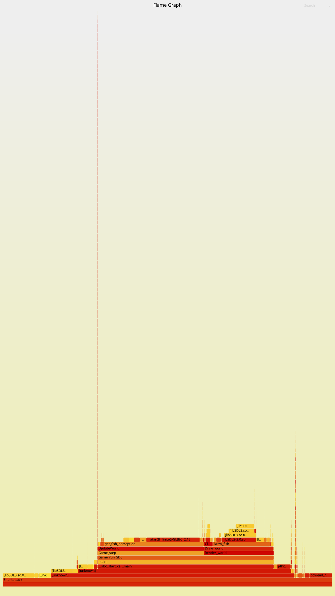

# Carnet de suivi SharkAttack

## 19 JUIN

### Matin

Discussion de l'état actuelle de shark attack.
A faire:

- Ajout règles repulsion pour les murs
- Modifier fish apply action pour abstraire la restriction de nouveau vecteur, à l'agent et non mj
- Céer test unitaire pour toutes les fonctions.
- Détecter bug existant.
- Sacha : test unitaire (vector / fish / mj)

### Après-midi

Sacha:

- Ajout de seed aux randoms position/veocity de fish et shark
Question les paramètres doivent-ils être entre 0 et 1 ??
- Comprendre le SMA et comment appliquer Reinforce

Compréhension SMA:

- Calcul des vecteurs direction de chaque règles

Agent:
Phase 1: C'est ici que l'on calcule le vecteur d'intérêts pour les types de règles.
    Vecteur intérêts: Une liste de plusieurs valeurs définissant l'intérêts de chaque règle.
    Règle : Alignement / Cohésion / Répulsion

1. Initialisation arbitraire de ce vecteur
2. Calcul pour chaque règle Alignement / Cohésion / Répulsion du nouveau coef à ajouter (ce calcul généralement par la norme du vecteur velocité souhaité)
3. Ajout au vecteur vecteur d'intérêts chaque poids calculer précédement

Phase 2:

- Softmax avec une température arbitraire
- Donne vecteur de probabilité (list de proba pour chaque décision)

Phase 3:

- Multiplie chaque vecteur direction par sa probabilité associé
- Somme l'ensemble de ces vecteurs pour le renvoyer

Mj:

- Ajoute le vecteur renvoyé en phase 3 au vecteur velocité
- Normalise la nouvelle velocité si supérieur à la vitesse max
- Mise à jour de la position par le vecteur.

## 22 Juin

### Matin

Compréhension de la partie court ainsi que de la mise en place de l'algorithme REINFORCE.

- Reformulation de la perception poisson, enlever la création de tableau annexe pour calculer les positions voulue eà la volée.
Utilisation du profiler `perf` pour identifier les goulots d'étranglement du programme.

### Après-midi

Optimisation de la partie perception du poisson, en considérant l'ordre des variables, l'optimisation des calculs d'angle et de distance.
